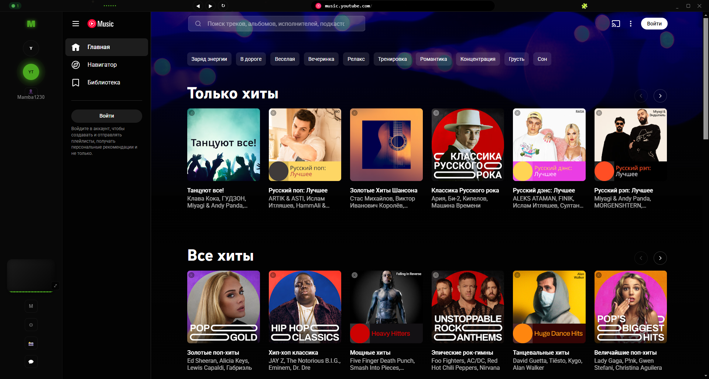
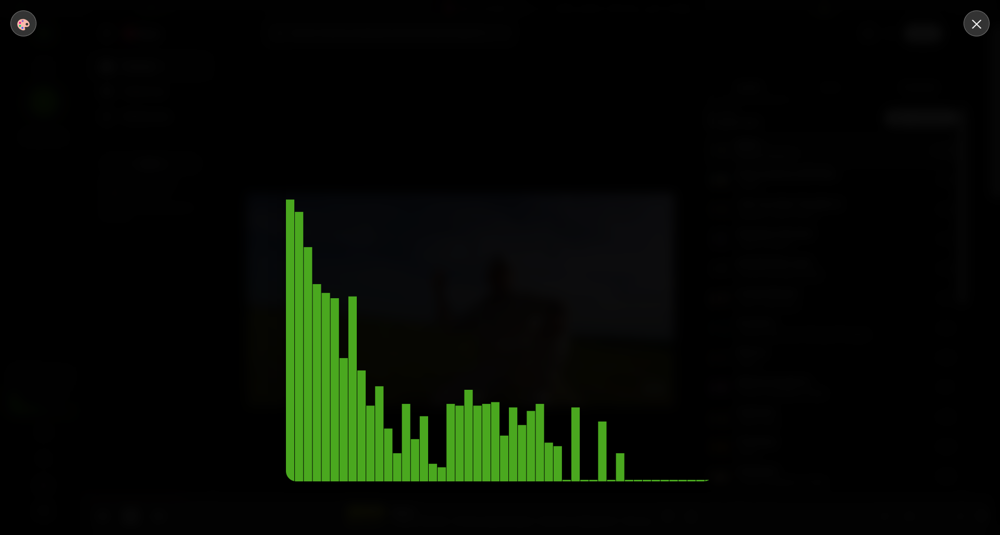

# 🎵 MusicHub

> **100% чисто вайбкодинг** — весь проект создан с помощью нейросетей без единой строки, написанной человеком вручную.  
> И да, он реально работает.

[](https://www.electronjs.org/)
[](LICENSE)
[](http://makeapullrequest.com)

---

## 🚀 О проекте

**MusicHub** — это десктопный музыкальный плеер-агрегатор, который объединяет несколько стриминговых сервисов в одном окне.  
С визуализациями, чатом с AI, поддержкой расширений и полной кастомизацией интерфейса.

> ⚠️ **Важное предупреждение:** проект полностью создан при помощи вайбкодинга (нейросети).  
> Некоторые участки кода могут вызывать желание переписать, но оно работает. Не судите строго 🙃

---

## ✨ Возможности

### 🎵 Музыкальные сервисы
- Яндекс Музыка, YouTube Music, SoundCloud, Spotify, VK Music
- До 2 сервисов одновременно (можно выбрать любые)
- Кастомные сайты — добавляй любые музыкальные URL

### 🎨 Визуализации (10+ режимов)
- **Базовые:** Полоски, Волна, Круг, Частицы
- **GIF** — своя анимация, реагирующая на музыку
- Полноэкранный режим с переключением эффектов

### 🎤 Захват звука
- Выбор микрофона или Virtual Audio Cable
- Реальная реакция визуализаций на громкость
- Регулируемая чувствительность

### 💬 Чат с AI
- Интеграция с GigaChat (Сбер)
- Команды: `/ai`, `/clear`, `/coin`, `/help`
- Premium открывает безлимитные запросы

### 🎨 Интерфейс
- Тёмная и светлая темы
- Акцентный цвет (любой на выбор)
- macOS / Windows стиль кнопок окна (переключается)
- Регулируемый масштаб (80% / 100% / 120%)
- Мини-режим — окно поверх всех окон
- Эффекты кнопок: Пульсация / Свечение

### 💎 Premium (было желание сделать платным но все бесплатно)
- Все визуализации 
- Безлимитный AI в чате
- Кастомные сайты (до 5 штук)

### 🎮 Управление
- `Ctrl+Tab` — переключение между сервисами (даже когда окно не активно)
- Навигация ◀ ▶ в тайтлбаре
- Клик по URL — копирует ссылку

---

## 📸 Скриншоты

| Интерфейс | Визуализация |
|-----------|--------------|
|  |  |

---

## 🛠️ Технологии

| Технология | Для чего |
|------------|----------|
| Electron | Десктопный фреймворк |
| HTML/CSS/JS | Интерфейс и логика |
| Web Audio API | Анализ звука, визуализации |
| WebSocket | Чат (с Cloudflare Worker) |
| Cloudflare Workers | Premium-бэкенд, WebSocket |
| Chrome Extensions API | Установка расширений |

---


## 📦 Установка

```bash
# Клонируем репозиторий
git clone https://github.com/Mamba1230/musichub.git
cd musichub

# Устанавливаем зависимости
npm install

# Запускаем
npm start
